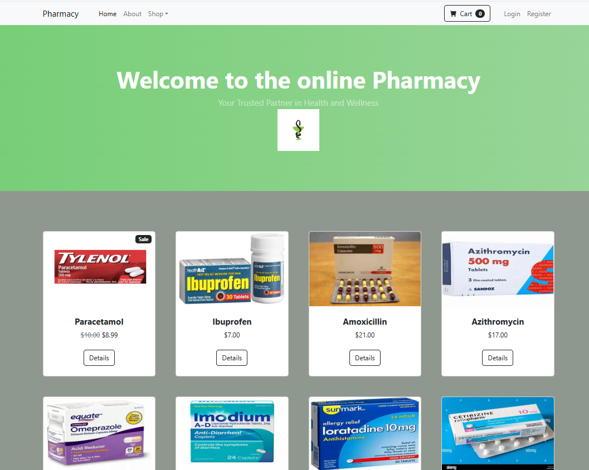

# Eshop Medicine

## Table of Contents
1. [Description](#description)
2. [Installation](#installation)
3. [Features](#features)
4. [Technologies](#technologies)
5. [Screenshots](#screenshots)


## Description
Eshop Medicine is an online platform designed to simplify the process of purchasing medications. Users can browse a wide range of pharmaceutical products, add them to their cart securely from the comfort of their home.

## Installation
1. Clone the repository:
    ```bash
    git clone https://github.com/tsiory17/Eshop_medicine.git
    ```
2. Navigate to the project directory:
    ```bash
    cd eshop-medicine
    ```
3. Create and activate a virtual environment:
    ```bash
    python -m venv venv
    source env/bin/activate  # On Windows use `venv\Scripts\activate`
    ```
4. Apply migrations:
    ```bash
    python manage.py migrate
    ```
5. Run the development server:
    ```bash
    python manage.py runserver
    ```

## Features 
- **Home Page**: Browse featured products and categories. 
- **Category Page**: Navigate through different categories of medications. 
- **Product Detail Page**: View detailed information about a medication. 
- **Cart Page**: Review items in your cart and proceed to checkout. 
- **Login Page**: Secure login for users. 
- **Register Page**: Register a new account.

## Technologies
- **Frontend**: HTML, CSS, JavaScript
- **Backend**: Python, Django
- **Database**: SQLite
- **Authentication**: Django Allauth
- 
## Screenshots
### Homepage 
 
### About Page 
 
### Category Page 
 
( ./media/7-digestive.png)
### Login Page 
 
### Register Page 
 
### Product Details Page 
 
### Cart Summary 


